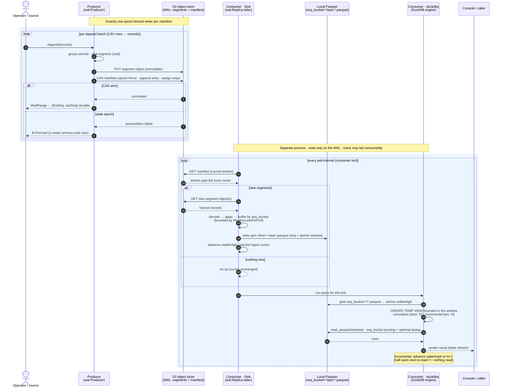

# Stream demo - production data flow

How the pieces interact when the producer and consumer run as **separate
processes** against a shared object store (S3/MinIO). The producer is the single
epoch-fenced writer of the WAL; one or more consumers tail it read-only,
materialize local Parquet, and serve queries with DuckDB.

## Reading the diagram

**Producer (write path, steps 1–9).** Each `Append` group-commits, seals a
segment, and writes it to the object store as an immutable blob *before* a
compare-and-swap on the manifest. The CAS is epoch-fenced: a stale primary whose
epoch was bumped by a newer one gets `ErrFenced` on its next commit, so at most
one writer ever advances the log. Per-record sequence numbers are assigned at
manifest-append time; `WaitRange` returns the durable `[first..last]` range.

**Consumer (read path, the poll loop).** A `wal.Replica` inside the `Sink` reads
the manifest, fetches only segments past its local cursor, decodes the framed
records, and buffers them by `seq_bucket`. Completed buckets are written as
Parquet via temp-file + atomic rename, then `visibleHigh` and the ingest cursor
advance - the cursor only moves once rows are durable on disk, so a crash
re-ingests at-least-once (read-side dedup on `seq` makes that exactly-once).
`MaxRecordsPerPoll` optionally paces ingestion so the view builds up gradually.

**Query (the trigger).** After ingesting, the same tick drives `duckdbq`: it
re-globs the Parquet directory to derive the current `visibleHigh` (so files the
Sink just wrote appear automatically), defines a TEMP VIEW bounded to the query
window, and runs the caller's SQL over `read_parquet` - with `seq_bucket`
partition pruning and optional dedup. Cumulative re-aggregates over
`[start, visibleHigh]` each tick (running totals); incremental returns only
`[watermark, visibleHigh]` and advances the half-open watermark to
`visibleHigh+1`.

## Production notes

- **One writer, many readers.** The manifest CAS fences writers; readers are not
  fenced, so any number of consumers can tail the same WAL, each maintaining its
  own local Parquet + cursor. Lag is ~one poll interval.
- **Object store is the source of truth.** Segments are immutable; the manifest
  is the only mutable object and is updated only by CAS. Local Parquet is a
  derived, rebuildable cache.
- **Same code path over `s3://`.** This demo keeps Parquet local, but pointing
  `duckdbq.Config.ReadGlob` at `s3://…` (with `httpfs` loaded) lets a separate
  query process read files a consumer uploaded - the query layer re-globs either
  way.
